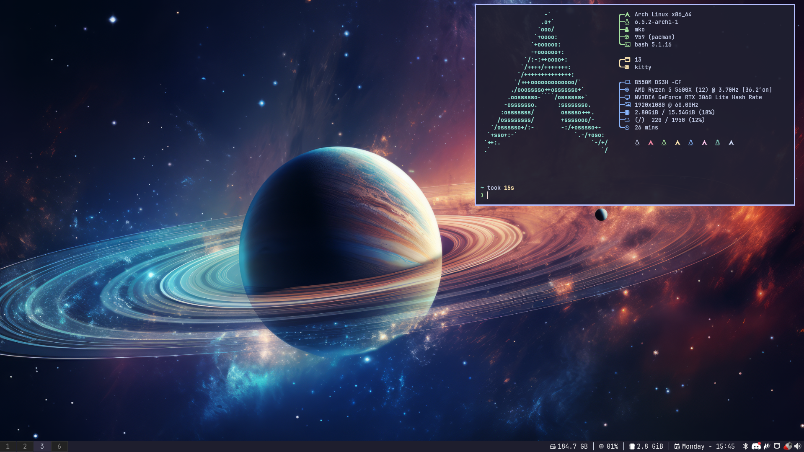

# i3-mko

My i3wm Configuration *optionally* including [nvim-mko](https://github.com/gitmko/nvim-mko) and [tmux-mko](https://github.com/gitmko/tmux-mko).




## Distros supported:
- [x] Arch 
- [x] Debian 
- [x] Fedora 

## Installation

Installation is done using my very own [dotfiles-installer](https://github.com/gitmko/dotfiles-installer).

You need [gum](https://github.com/charmbracelet/gum) installed for the script to work.

Find out how to install gum in the dotfiles-installer repo in the [installation](https://github.com/gitmko/dotfiles-installer#Installation) guide.


```
git clone https://github.com/gitmko/dotfiles-installer
cd dotfiles-installer/scripts
bash install
```
